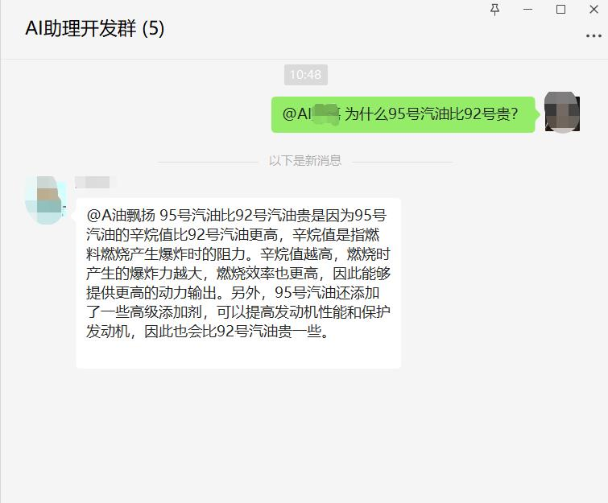

# wechatbot-nodejs

支持在本地电脑扫码登录，接入GPT，让自己的微信自动回复消息。

本项目可以实现：

群聊@回复

私聊回复

# 功能特色

支持群白名单

支持群关键字过滤

支持特定提问回复

# 运行效果

# 使用步骤
0. 安装node环境、依赖，后期会提供一个免安装环境，省去此步骤；
1. 运行node bin\ini.js，创建pubkey；
2. 把config.ini.sample改为config.ini，根据注释配置config.ini；
3. 运行node index.js，扫码登录；
4. 配置服务端，需要pubkey和openAI的key。服务端程序应该运行在一台国外ip的服务器上（服务端参考[这里](https://github.com/sinajia/wechatbot-server)）。如不方便也可忽略这一步，但需使用别人提供的服务，则只需提供第一步得到的pubkey即可。此步骤有问题，也可邮箱联系我；
5. 正确填写config.ini里面的FOREIGN_ADDR。

# 一键三连支持作者
😊😊😊
